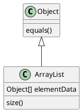

PlantUML inline via code block support
======================================

```puml
@startuml
Object <|-- ArrayList

Object : equals()
ArrayList : Object[] elementData
ArrayList : size()

@enduml
```

